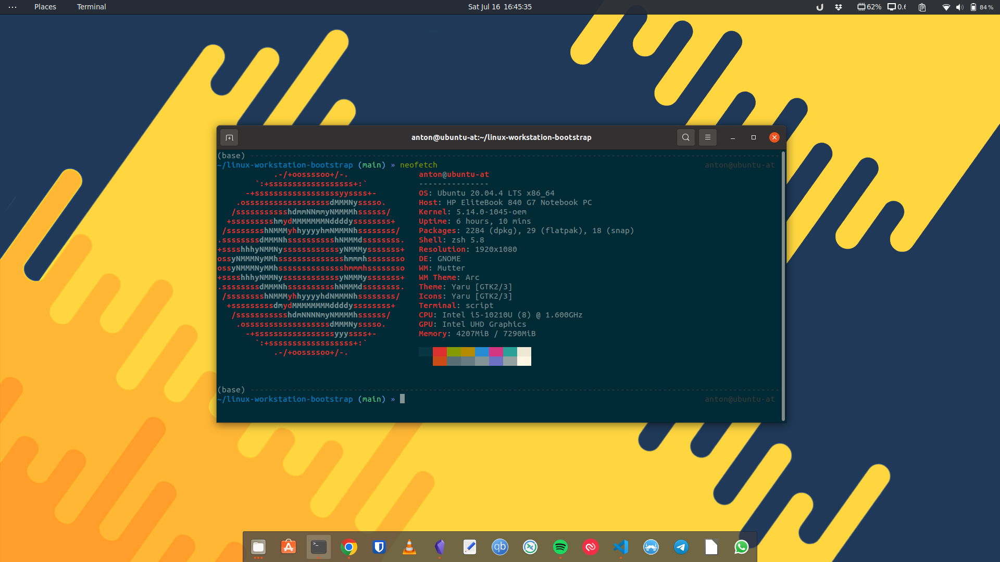

# Linux Bootstraping Repo

Repository to assist in bootstraping my Linux (Ubuntu) workstation and to take the headache away from remembering to install everything. It will perform the following tasks:
 - Update system
 - Install desired apt/snaps/flatpaks
 - Download dotfiles

## Screenshot Preview


## Before you re-install, checklist:

 - Have all local downloads been backuped?
 - Have all commits been pushed?
 - Have you backuped gnome?
   - `cd $HOME/linux-workstation-bootstrap/files/gnome && ./backup-gnome.sh`


## Downloading Repo 

1. Create SSH keys:
```shell
sudo apt update 
sudo apt install -y ssh git
ssh-keygen -t rsa -b 4096 -C "tofft.anton@gmail.com"
eval $(ssh-agent -s)
ssh-add ~/.ssh/id_rsa
```

2. Copy SSH Keys:
```shell
cat ~/.ssh/id_rsa.pub
```

3. Add SSH Keys: [github.com/settings/ssh/new](https://github.com/settings/ssh/new)

4. Clone Repository:
```shell 
git clone git@github.com:a-tofft/linux-workstation-bootstrap.git 
cd linux-workstation-bootstrap 
```

## Installing


### Step 1
Run initial bootstrap script to update system and install ansible
```shell
./bootstrap.sh 
```


### Step 2
Run playbook to deploy system. Do not run as sudo. 
```shell 
ansible-playbook local.yml --ask-become-pass -e ansible_user=$(whoami)
```

### Step 3

Install Dropbox: https://www.dropbox.com/install


### Step 4
Restore Gnome Settings
```shell
cp -r ~/Dropbox/Backups/$(hostname)/shell-extensions/* ~/.local/share/gnome-shell/extensions/
dconf load / < ~/Dropbox/Backups/$(hostname)/dconf-settings
```

# Configurations Saved in Cloud:
Contains data that does not need to be provisioned 
 - VisualStudioCode Settings/Extensions 
 - GoogleChrome Settings/Extensions 

# Dotfiles Installation:
GNU Stow is used for dotfile management and dotfiles are kept in a separate repo
```shell
$ git clone git@github.com:a-tofft/dotfiles.git ~/.dotfiles
$ cd ~/.dotfiles
$ stow -t ~ */
```
